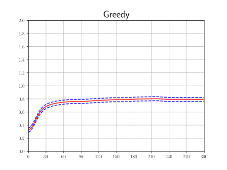
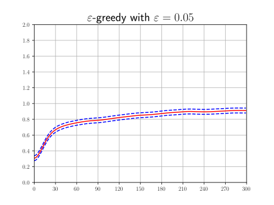
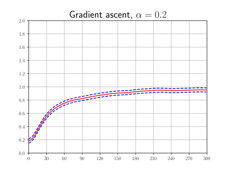
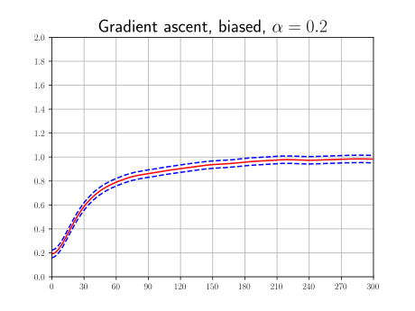
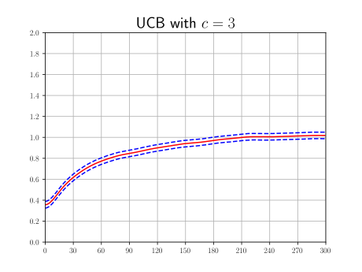
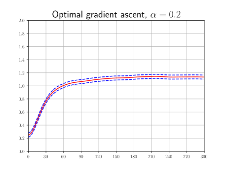
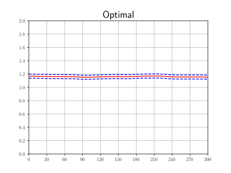

Just a repository with reinforcement learning experiments.

To use environments from here you will want to install it as a module. 
To do so run `pip install -e implementations` from the root of the repository.

## Multi-armed bandit problem
Here several algorithms were compared in the same conditions:
$5$ arms, $300$ steps, action value for each arm is sampled from standard normal distribution,
on each step observed value is sampled from $\mathcal{N}(\text{action value}, 3)$. For other details see `benchmark.py`.

| Method | Total reward |
|--------|--------------|
| greedy | 225±10 |
| $\varepsilon$-greedy     | 242±10           |
| gradient      | 247±10            |
| gradient_biased | 256±10 |
| UCB | 262±10 |
| optimal_gradient | 308±10 |
| optimal | 350±10 |

Greedy algorithm tries each arm ones, and then selects the one with maximal mean value observed so far.

Its modification, $\varepsilon$-greedy, does the same, but with chance $\varepsilon$ it selects arm randomly.

Gradient ascent learns probabilities of taking each action instead of action values.

This version uses biased estimator of gradient, but on this testbed it works even better.

Upper Confidence Bound method calculates for each arm an optimistic estimate of its value which gets closer to the real value with more tries.
Then selects the action with the highest estimate.

It is supposed to be an upper-bound for all gradient methods. This algorithm has access to the true action values and uses it to calculate exact gradients.

And this is an upper-bound for all algorithms, because it always takes the action with highest true value. 
